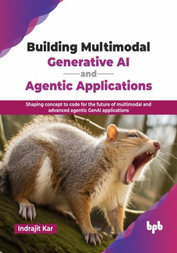

# Building Multimodal Generative AI and Agentic Applications

Shaping concept to code for the future of multimodal and advanced agentic GenAI applications.

This is the repository for [Building Multimodal Generative AI and Agentic Applications
](https://bpbonline.com/products/building-multimodal-generative-ai-and-agentic-applications?_pos=1&_sid=adf99555c&_ss=r&variant=44798711431368?variant=44798711431368),published by BPB Publications.

## About the Book
Generative AI and agentic AI are reshaping how we interact with data, enabling intelligent systems that can reason, generate, and autonomously act across multiple modalities. From text and images to voice and structured data, these technologies are increasingly essential in enterprise and research applications today. 

This book offers a complete roadmap to mastering multimodal generative AI and agentic AI systems. It covers foundational concepts, vision-language models, retrieval-augmented generation, human-in-the-loop and multi-agent workflows, text-to-SQL, OCR, and hybrid AI integrations. Each chapter combines theory, practical guidance, code implementations, and real-world case studies, helping readers understand architectures, pipelines, and production-grade deployments.

By the end of this book, readers will be capable of designing, implementing, and scaling robust multimodal and agentic AI systems. They will gain hands-on expertise in reasoning, generation, retrieval, agent orchestration, and Ops, equipping them to build production-ready AI applications and excel in their roles.

## What You Will Learn
• Understand multimodal generative AI and agentic AI systems.

• Architecting RAG, vector DBs, embeddings, cross-encoders, and core agentic planning.

• Build retrieval-augmented generation workflows efficiently.

• Implement human-in-the-loop and multi-agent pipelines.

• Apply text-to-SQL for real-time data queries.

• Develop OCR solutions for images and documents.

• Integrate traditional ML models with GenAI workflows.

• Deploy production-grade AI with monitoring and observability.
